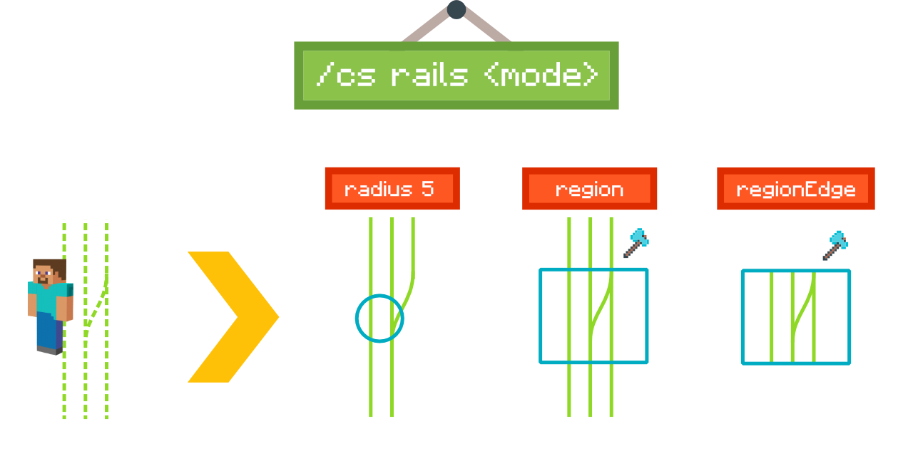

<br />
<p align="center">
  <a href="https://github.com/othneildrew/Best-README-Template">
    
  </a>

  <h1 align="center">BTE-tools</h1>

  <p align="center">
    Awesome tools and scripts to enhance your experience on the Build The Earth project!
    <br />
    <a href="https://buildtheearth.net/"><strong>Go to Build The Earth »</strong></a>
    <br />
    <br />
    <a href="https://github.com/oganexon/BTE-tools/issues">Report Bug</a>
    ·
    <a href="https://github.com/oganexon/BTE-tools/issues">Request Feature</a>
  </p>
</p>


## Table of Contents

- [Table of Contents](#table-of-contents)
- [About The Project](#about-the-project)
  - [Built With](#built-with)
- [Getting Started](#getting-started)
  - [Prerequisites](#prerequisites)
  - [Installation](#installation)
- [Usage](#usage)
  - [Installing the script](#installing-the-script)
  - [Generating data using Overpass Turbo](#generating-data-using-overpass-turbo)
  - [Generating data just with coordinates](#generating-data-just-with-coordinates)
  - [Converting data](#converting-data)
  - [Run the script in game](#run-the-script-in-game)
- [Roadmap](#roadmap)
- [Contributing](#contributing)
- [License](#license)
- [Contact](#contact)


## About The Project



The BTE generation is not perfect and some structures such as railway lines are missing.
Doing it by hand is unthinkable given the curves and the number of measurements that would have to be taken. 
- It is a WorldEdit script: 
  - in case of problem the command `//undo` is always available. 
  - no loading of chunks by the players, and it's very fast. 
- You generate the data on your computer, the script on the server only plots, so there is a minimum of operations and lag. 
- You have control over the data, whether the rails in a defined area or an entire line.
- You can also trace any missing structure

### Built With

* [Node](https://nodejs.org/)
* [AutoHotkey](https://www.autohotkey.com/)

## Getting Started

### Prerequisites

You must have [Node](https://nodejs.org/) and npm installed on your system. (Comes with it)

### Installation

1. Clone the repo
```sh
git clone https://github.com/oganexon/BTE-tools.git
```
2. Install NPM packages
```sh
npm install
```

## Usage

The only functionality at the moment is the railways.

### Installing the script

Before you start using CraftScripts, you’ll have to install the [Rhino JavaScript engine](https://developer.mozilla.org/en-US/docs/Mozilla/Projects/Rhino).
A direct link to the download is [here](https://github.com/mozilla/rhino/releases/download/Rhino1_7_12_Release/rhino-1.7.12.zip).
Open the zip file, and extract `rhino-1.7.12.jar` (or newer).
Move `rhino-1.7.12.jar` to the plugins/ or plugins/WorldEdit folder (on Bukkit) or the mods folder (other platforms).

Once you have the JS engine installed, drop `draw.js` in the craftscripts folder (in the WorldEdit config folder - either plugins/WorldEdit or
config/WorldEdit depending on platform).

### Generating data using Overpass Turbo

By using turbo overpass, you can view the selection directly. This is the recommended method.

Use the [region request](http://overpass-turbo.eu/s/TwW) or the [name request](http://overpass-turbo.eu/s/TwY)

The region request is used to select every rail in the bounding box.

The name request is used to select every rail of a defined line.

To find a railway name, right click near the rails and click on `Query features`


Then, click on the desired rail


And finally, get the name.


To get the correct data, click on `export` then `download/copy as GeoJSON`.

### Generating data just with coordinates

Go on [OpenStreetMap](https://www.openstreetmap.org/) and select the region of interest.

Take the coordinates of the lowest point on the right and the highest point on the left.

Put them in the config file (read the next paragraph).

### Converting data

Go to `./draw/src`

```sh
cd ./draw/src
```

Configure `config.json`: 

```json
{
  "block": "iron_block",
  "logFile": "C:\\Users\\[USERNAME]\\Twitch\\Minecraft\\Instances\\Build The Earth modpack\\logs\\latest.log",
  "output": "output.json",
  "input": "input.json",
  "overpass": false, // if true, will request data to the API with the following parameters
  "requestType": "region",
  "region": "47.6008,6.9398,47.6131,6.9569", // Coordinates retrieved with OpenStreetMap
  "name": "LGV Rhin-Rhône",
  "feature": "rails" // More to come
}
```

If you used Overpass Turbo, put the geoJSON data in `draw/input.json`

You're all set. Open Minecraft, it will be used to convert coordinates.

```sh
node init.js
```

Then, run convert.exe and select `temp.json`. You're asked to put a delay, if your computer is quite slow you should increase it.
After the warning, you have 2 seconds to click on Minecraft, then it will enter commands automatically.

When finished, run:

```sh
node generate.js
```

The process is over, copy `output.json` to `/drawings` in the `/worldedit` folder.

### Run the script in game

```sh
/cs draw output [block] [options]
```

It should take a few seconds depending on data size. You should put `scripting-timeout` to a higher value like `30000` 
in `worldedit.properties` to avoid timeout since it takes longer to compute the first time.

## Roadmap

See the [open issues](https://github.com/oganexon/BTE-tools/issues) for a list of proposed features (and known issues).


<!-- CONTRIBUTING -->
## Contributing

Contributions are what make the open source community such an amazing place to be learn, inspire, and create. Any contributions you make are **greatly appreciated**.

1. Fork the Project
2. Create your Feature Branch (`git checkout -b feature/AmazingFeature`)
3. Commit your Changes (`git commit -m 'Add some AmazingFeature'`)
4. Push to the Branch (`git push origin feature/AmazingFeature`)
5. Open a Pull Request


<!-- LICENSE -->
## License

Distributed under the MIT License. See `LICENSE` for more information.


<!-- CONTACT -->
## Contact

Oganexon#2001 - Discord
